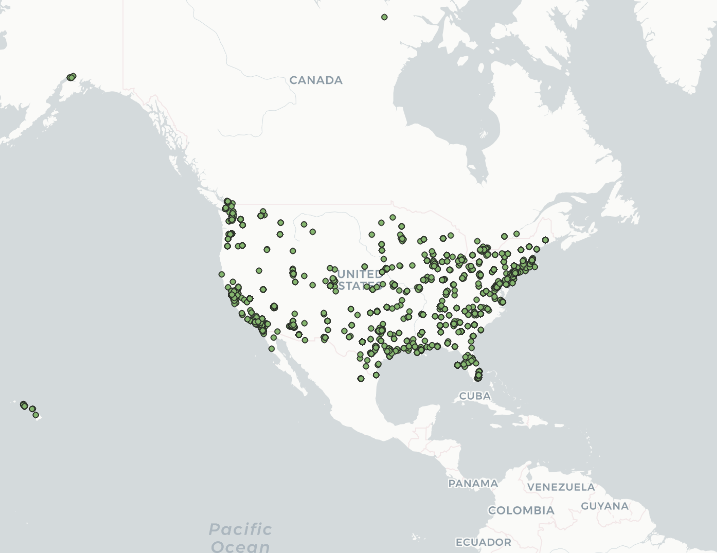
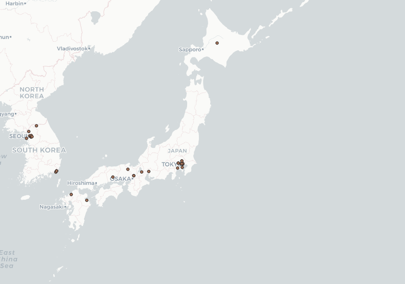

# Lab 2
# Q1
I collected tweets data and made a map and created word art from 2 places, the United States, including Hawaii and Alaska, and Japan. I wanted to make this comparison because I live in the United States, and I am interested in Japanese culture. From this word art we can tell that words with the most frequent appearances includes "up", "Love", "Go", "See", "Time". In the Japan word art, words with the most frequent appearances are "Many", "Spot", "New", "Go", "Son", "San". It seems that United States uses Twitter for more everyday usage and Japanese twitter content includes a higher density of shorthands like "Jp" and "FYI". The word "Korea" in Japanese twitter word art also caught my eye, this refelcts that Japanese twitter have a good amount of discussion on Korea, whether it is admiration for korean idols or arguments between the 2 country's netizens are not known.

# Q2

The first image is the tweet geo distribution map of USA, the second image is the tweet geo distribution map of Japan. We can see, there seem to be more incidents in the USA. In the USA, incidents are evely spred throught the country, but in Japn, incidents are Tokyo and Osaka, which makes sense as those are the pace people populate in Japan. I believe I have inserted the location right, but don't know why there are also incidents from Seoul.

# Q3

The first word art is on the tweet incidents in USA, the second word art is on the tweet incidents in Japan. Comparing these word clouds, we know that the USA context is more related to daily life, with words people use in normal conversations. Reflecting Twitter being more popular in the USA, all kinds of conversations are going on in US Twitter. Japan on the other side, seem to use Twitter for some special topic, as we see the density of words related to certain topic is high.